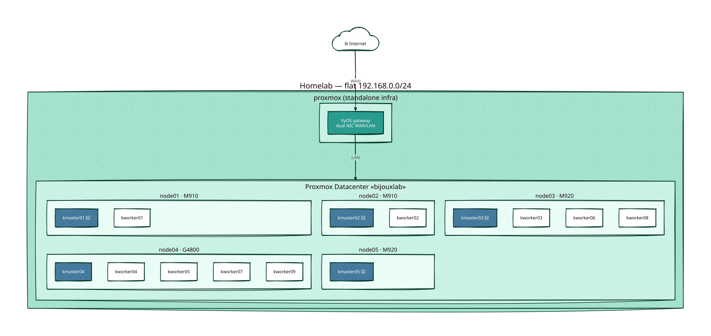
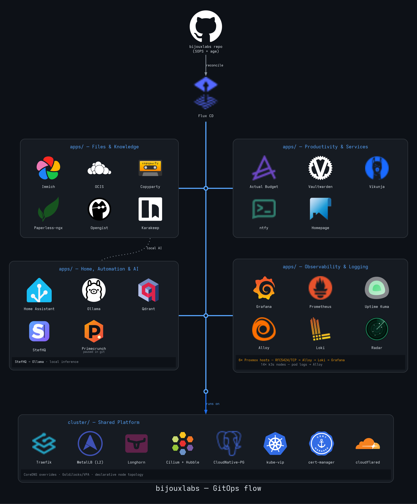

# bijouxlabs - GitOps Homelab

A 14-node k3s cluster running across a Proxmox homelab and managed through Flux CD. It grew through every stage of self-hosting: hand-built VMs, a Raspberry Pi running out of RAM, Portainer managing containers across mini PCs, and finally a Kubernetes environment substantial enough to learn from by operating every day.

---

## Background

I spent years in a senior SP networking role: MPLS, BGP, the whole vendor-locked stack. I learn best by doing and while there were plenty of options (Packet tracer, GNS3, Hardware labs) my experience was roughly the same: spend ages rewriting boilerplate configs, reading vendor docs and pasting configs. Once that was done and the routes were learned or pings returned, that was kind of the end of meaningful work on the lab. The gaps you don't close by stopping there are significant. You had an idea of how to implement a feature and some approximation of what production would look like but it felt inert and unresponsive.

When I moved almost exclusively into Linux, scripting and systems work I had to learn a lot of new tools and techniques — many of which would be the same upstream systems that integrated into the network infrastructure.

The self-hosting journey ran parallel to that. A Pi doing DNS ad-blocking and a few containers quickly hit resource limits (and in 2015, finding ARM-compatible images for anything was its own adventure). A cheap mini PC from Amazon to add resources also added many new variables to account for. Home Assistant wired to a handful of IoT sensors was a genuine turning point — the first time the lab felt like it was actually doing something.

Fast forward: containers spread across two mini PCs and entropy quietly crept in: logins, OS versions, config directories and daemons to remember. It worked until it didn't. Portainer helped manage some of that complexity for a while. I learned of Kubernetes and was immediately intimidated. I tried the books and online tutorials but it was difficult to map that understanding to a context I was familiar with. Slowly the decision to use my own lab to learn Kubernetes became clear.

---

## Architecture

### Physical topology

Six Proxmox hosts make up the lab. Five clustered hosts carry the 14 k3s VMs, with one etcd master in each physical failure domain; a standalone infrastructure host runs the VyOS gateway. The five-master control plane retains quorum through a single-host maintenance window or failure.



💾 = an NVMe-backed Longhorn disk (`nvme` disk tag). Four masters currently provide these disks across four physical zones.

### GitOps flow



Diagram sources live in [`docs/`](docs/) ([D2](https://d2lang.com) + [Graphviz](https://graphviz.org)); regenerate both with [`scripts/render-diagrams.sh`](scripts/render-diagrams.sh).

**Control plane HA** is handled by kube-vip as a DaemonSet, providing a static VIP across all five masters. Every master is declaratively tainted for control-plane and storage duties; normal application workloads run on workers.

**Storage** is split intentionally:

- `kmaster01`, `kmaster02`, `kmaster03`, and `kmaster05` provide `nvme`-tagged disks in four separate Proxmox zones.
- Durable volumes use three replicas, leaving one NVMe zone available for rebuilds during maintenance.
- `longhorn-nvme` provides two-replica NVMe storage where availability matters but a third synchronous copy is unnecessary.
- `longhorn-ephemeral` gives Prometheus two replicas but no backups; its TSDB is intentionally recreated rather than repaired.

**Networking** uses MetalLB in L2 mode for LoadBalancer IPs and Traefik as the ingress controller, with TLS terminated via Cloudflare's ACME DNS challenge. A `cloudflared` deployment runs as cluster infrastructure to expose selected services externally via Cloudflare Tunnel without port forwarding.

**Observability** combines kube-prometheus-stack, Grafana, Uptime Kuma, Radar, Hubble, Loki, and Grafana Alloy. Alloy runs on all 14 k3s nodes for pod logs. All six Proxmox hosts push RFC5424 syslog over TCP to Alloy through a MetalLB endpoint, which forwards it to Loki; the external dead-man's switch deliberately remains outside the cluster.

The architectural and operational choices behind this setup are recorded in [`DECISIONS.md`](DECISIONS.md).

---

## Stack

| Layer | Tool |
|---|---|
| Hypervisor | Proxmox |
| Network gateway | VyOS |
| Kubernetes | k3s |
| GitOps | Flux CD v2 |
| Ingress | Traefik v3 |
| Load Balancer | MetalLB (L2) |
| Control Plane HA | kube-vip |
| Storage | Longhorn |
| CNI | Cilium + Hubble |
| Database operator | CloudNative-PG |
| TLS | cert-manager + Cloudflare DNS-01 |
| Secrets | SOPS + age |
| External tunnel | cloudflared (Cloudflare Tunnel) |
| Metrics and dashboards | Prometheus + Grafana |
| Logs | Grafana Alloy + Loki |
| Uptime and liveness | Uptime Kuma + external Healthchecks.io dead-man switch |
| Resource recommendations | Goldilocks + VPA |

---

## Applications

| App | Description |
|---|---|
| [Actual Budget](https://actualbudget.org) | Privacy-focused personal finance and budgeting |
| [Immich](https://immich.app) | Self-hosted photo library; CNPG cluster with VectorChord for ML embeddings |
| [Vaultwarden](https://github.com/dani-garcia/vaultwarden) | Self-hosted Bitwarden-compatible password manager |
| [Vikunja](https://vikunja.io) | Task and project management |
| [Paperless-ngx](https://docs.paperless-ngx.com) | Document management with OCR; sidecars: Valkey, Apache Tika, Gotenberg |
| [Karakeep](https://karakeep.app) | Bookmark manager with AI-powered crawling, tagging and search via local Ollama |
| [Home Assistant](https://www.home-assistant.io) | IoT and home automation |
| [Homepage](https://gethomepage.dev) | Unified service dashboard |
| [ntfy](https://ntfy.sh) | Self-hosted push notifications and Alertmanager delivery |
| [Uptime Kuma](https://github.com/louislam/uptime-kuma) | Service uptime monitoring |
| [Opengist](https://github.com/thomiceli/opengist) | Self-hosted gist service |
| [Copyparty](https://github.com/9001/copyparty) | Self-hosted file sharing |
| [ownCloud Infinite Scale](https://owncloud.dev/ocis/) | Self-hosted Google Drive replacement; single-binary OCIS on NVMe-backed Longhorn |
| [StefHQ](https://github.com/SLBij/stefhq) | Personal AI assistant — FastAPI + SvelteKit + ARQ worker + pgvector + Ollama |
| [Primecrunch](https://github.com/angelobrsa/primecrunch-docker) | Self-hosted Prime Video catalogue browser; currently paused in Git (`replicas: 0`) |
| [Radar](https://github.com/skyhook-io/radar) | Kubernetes cluster visibility — workloads, traffic (via Hubble), events |
| [Qdrant](https://qdrant.tech) | Vector database for semantic search and RAG |
| [Ollama](https://ollama.com) | Local LLM inference server (`llama3.2`, `nomic-embed-text`, `moondream`) |

---

## Repo Structure

```
.
├── DECISIONS.md        # Architectural and operational decision register
├── cluster/
│   ├── flux-system/    # Flux bootstrapping + Kustomization CRs
│   ├── topology/       # Declarative node zones and master taints
│   ├── traefik/        # Ingress controller + TLS config
│   ├── metallb/        # L2 LoadBalancer IP pools
│   ├── longhorn/       # Distributed storage + StorageClass
│   ├── kube-vip/       # Control plane VIP DaemonSet
│   ├── cnpg/           # CloudNative-PG operator
│   ├── cilium/         # CNI + Hubble relay/UI
│   ├── cloudflared/    # Cloudflare Tunnel deployment (cluster infrastructure)
│   └── bijouxlabs/     # Proxmox node reverse-proxy (headless Services + Endpoints + Ingresses per host)
├── apps/
│   ├── logging/        # Alloy, Loki, syslog endpoint, Grafana datasource
│   ├── monitoring/     # kube-prometheus-stack, alerts and dashboards
│   └── <app>/          # Per-app resources, HelmRelease and SOPS secrets
├── docs/               # Diagram sources and rendered architecture
└── scripts/            # Diagram rendering and maintenance helpers
```

Secrets are encrypted with SOPS/age and committed directly to the repo. LAN IPs and credentials stay encrypted; domain names and non-sensitive config are hardcoded in manifests.

---

## The Hard Part

Getting Flux and SOPS to cooperate without everything blowing up took longer than I'd like to admit, and involved several compounding failures that were genuinely difficult to untangle.

The root issue: **kustomize replacement blocks execute before SOPS decryption**. Some early manifests used kustomize replacements to inject values from a SOPS-encrypted ConfigMap. What actually got substituted was raw `ENC[AES256_GCM,...]` ciphertext. MetalLB's admission webhook rejected the invalid CIDR format in `IPAddressPool.spec.addresses` and blocked all Flux reconciliation cluster-wide.

That alone would've been manageable. But the failure was compounding:

- `flux-system` wasn't included in the cluster Kustomization resources list. With `prune: true` enabled, Flux was quietly deleting its own CRDs and controller Deployments on every successful reconcile, then immediately re-applying them. It looked like things were working fine.
- A single typo (`NAMESPACES_APPLICATIONS` instead of `NAMESPACE_APPLICATIONS`) caused Flux to abort all `$(VAR)` postBuild substitution silently across the entire cluster, leaving raw variable tokens in every manifest.
- kube-vip had a chicken-and-egg dependency: it needed the `bijouxlabs-replacements` ConfigMap to exist before it could reconcile, but the ConfigMap was only available after the cluster was up.
- **postBuild `$(VAR)` substitution never reliably worked** in this cluster, proven live when a Traefik HelmRelease was found with a literal `$(LB_IP_TRAEFIK)` in it months after it was supposed to be substituted. The strategy is now to hardcode non-sensitive values directly in manifests.

Each fix exposed the next layer. The resolution was to stop fighting the tool: hardcode non-sensitive values directly in manifests, keep SOPS strictly for actual secrets, and annotate anything Flux shouldn't touch after initial apply with `kustomize.toolkit.fluxcd.io/ssa: ignore`.


---

## Secrets Management

SOPS with age encryption. The `.sops.yaml` at the repo root defines which paths are encrypted and with which key. The age public key is committed; the private key lives only on machines that need to decrypt.

Flux decrypts secrets at apply time via the `kustomize-controller` SOPS provider. Nothing is ever stored in plaintext in git.

One hard-learned rule: use `sops edit <file>` to modify already-encrypted files. Running `sops -e -i` on an already-encrypted file double-encrypts it and breaks everything silently.

---

## Roadmap

- [x] VyOS VM on Proxmox replacing OpenWrt router (dual NIC, flat 192.168.0.0/24)
- [x] Cloudflare Tunnel (`cloudflared`) deployed as cluster infrastructure
- [x] Tailscale subnet router for mobile access over tailnet
- [x] Central Loki logging for k3s and Proxmox syslog
- [ ] WiFi 6 APs with 802.11r/k/v and SSID 802.1Q tagging
- [ ] CrowdSec agent on VyOS for IoT egress monitoring
- [ ] Additional DRAM and NVMe capacity for Longhorn
- [ ] NAS for media storage
